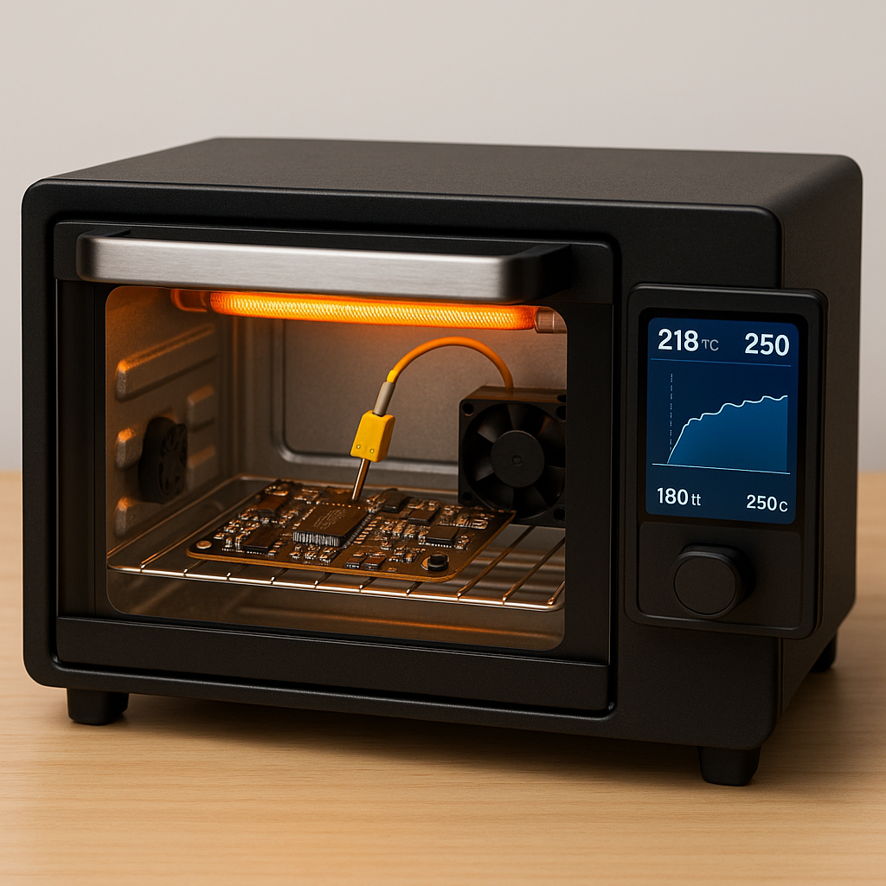

# reflow-oven-ui-nextjs

  

## 📌 Descrição

Este é o frontend desenvolvido em **Next.js 15** para um forno de refusão com display touch, utilizado na soldagem de componentes SMD em placas de circuito impresso. A aplicação roda em um **Raspberry Pi ou Orange Pi**, conectada via **RS422** a uma placa de potência baseada em STM32, permitindo o controle completo do processo de aquecimento, resfriamento e monitoramento em tempo real.

## ✨ Funcionalidades

- 📊 Criação e edição de perfis de temperatura (temperatura x tempo)
- 📈 Exibição em tempo real das leituras da placa de potência:
  - Temperatura da grelha (termopar tipo K)
  - Temperatura do dissipador da placa de potência (NTC)
  - Corrente de saída da resistência (sensor de efeito Hall)
  - Tensões (entrada [127VAC] e saída [0~180VDC])
  - RPM dos ventiladores, sendo um do forno e o outro da placa de potência (coolers)
- 📡 Comunicação robusta via RS422
- 📱 Interface touchscreen responsiva e otimizada para uso em Raspberry Pi/Orange Pi
- ❌ Exibição de falhas e alertas
- 🧠 Planejado para controle de malha fechada (PID)

# 👨‍🔧 Autor

| Nome | GitHub |
|------|--------|
| Eng. Eletrônico Criador do Projeto | [@LegiusAndrade](https://github.com/LegiusAndrade/) |

---

## 🛡️ Licença

